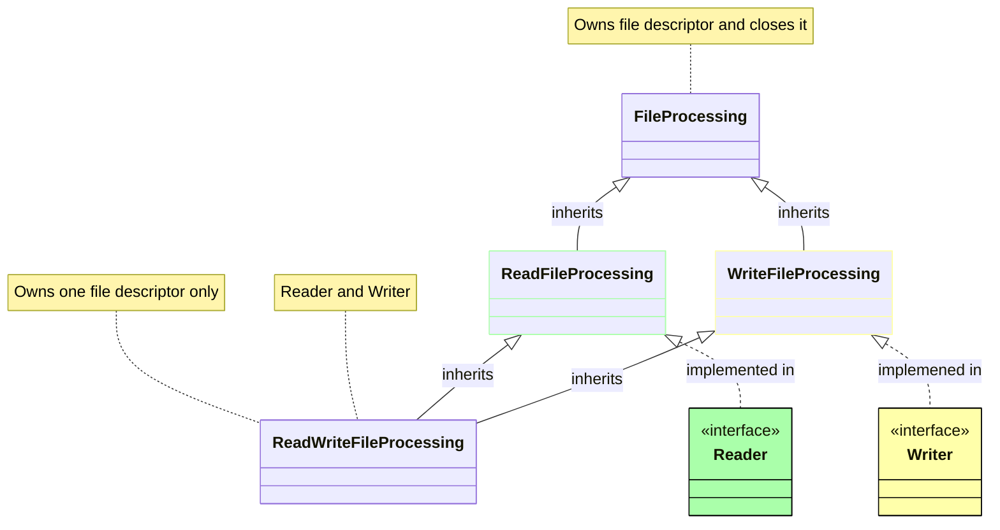
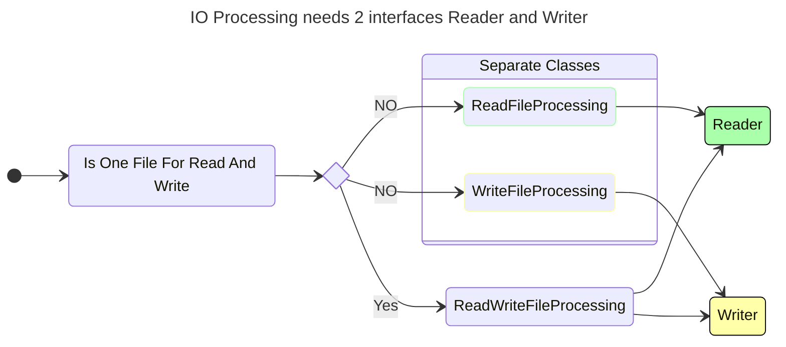

# `bpatch`

**PURPOSE:** Suppose you need to modify a file and replace several byte sequences with other byte sequences. Furthermore, imagine you want these modification rules to be formalized in a human-readable format, so they're easy to edit. If that's the case, then this tool is exactly what you need.

Domains where `bpatch` will be surely useful
<ul>

Encryption

  For example, you could create two mirror replacement rules to convert any text into an indecipherable set of unique binary sequences. In this way, only you and your intended recipient would be able to read your messages. Want more details - let the <a href="#contacts">author</a> know

</ul>
<ul>

Data migration; Data transformation

  If you understand how your data should be processed and what needs replacing, then bpatch is your solution. Furthermore, if you find any missing functionality, don't hesitate to <a href="#contacts">contact</a> the author

</ul>
<ul>

Forensic Analysis and Cybersecurity

  bpatch can be used to analyze and transform binary data, which is often crucial in these fields

</ul>
<ul>

Software development; Testing; Gaming Industry - Binary data transformations

  If you need to manipulate binary data frequently and want to automate these changes, bpatch could simplify this process

</ul>
<ul>

Automated Build and Deployment Pipelines

  bpatch can be part of Continuous Integration/Continuous Deployment (CI/CD) pipelines to handle the transformation of binary data as part of the build or deployment process

</ul>
<ul>

Software development - using of the bpatch as static library

  Developers can integrate bpatch as static library into their applications to handle binary data flows

</ul>

**MNEMONIC:** binary stream, substitution, sequential substitution, encryption, compression, binary data conversion, Test, Testing, Continuous integration, Cybersequrity, Data migration, Data transformation, Encryption, Binary data transformation, json parsing, C++ code style, C++ 20, application architecture, virtual inheritance, data flow

**Table of Contents:**
* [`bpatch`](#bpatch)
  * [Description](#description)
  * [File Descriptions](#file-descriptions)
    * [Entry Point](#entry-point)
    * [Library with the logic](#library-with-the-logic)
    * [Library wildcharacters](#wildcharacters-library)
    * [Unit Tests files](#unit-tests-files)
    * [Integration Tests files](#integration-tests-files)
  * [Building](#building)
  * [Unit Tests](#unit-tests)
  * [Integration Tests](#integration-tests)
  * [Architectural Diagrams](#architectural-diagrams)
  * [Contacts](#contacts)
  * [Copyright](#copyright)
  * [Reference](#reference)

## Description

`bpatch` is an application designed to transform a file's data based on easily readable and editable replacement rules. These rules are established in [JSON] format. Functionality provides sequential, parallel, and mixed modes to perform all possible data manipulation needs. Investigate [`bpatch_json.md`][bpatch_json_md] to acquire more details of the current set of possibilities 

## File Descriptions

The `bpatch` package exposes next group of files to user:

### Entry point

|File|Description|
|:-|:-|
|[`bpatch.cpp`][bpatch_cpp]|Contains  entry point to `bpatch` application.|

### Library with the logic

|File|Description|
|:-|:-|
|[`actionscollection.h`][actionscollection_h]| The class **ActionsCollection** serves as the main entry point for processing, housing the JSON parser callback for settings loading, as well as the pipeline for binary lexeme processing. [`actionscollection.cpp`][actionscollection_cpp]|
|[`binarylexeme.h`][binarylexeme_h]|The **AbstractBinaryLexeme** class encapsulates data; regulates access to the data; offers modification method and static creators. [`binarylexeme.cpp`][binarylexeme_cpp]|
|[`bpatchfolders.h`][bpatchfolders_h]|Access to the names of *Actions* and *Binary Patterns* folders. [`bpatchfolders.cpp`][bpatchfolders_cpp]|
|[`coloredconsole.h`][coloredconsole_h]| Templated wrapper for text to output in console ERROR in red and Warning in yellow colors. [`coloredconsole.cpp`][coloredconsole_cpp]|
|[`consoleparametersreader.h`][consoleparametersreader_h]|The **ConsoleParametersReader** class parses console parameters, stores settings for processing, and maintains a *'manual'* text (could be found in [`consoleparametersreader.cpp`][consoleparametersreader_cpp])|
|[`dictionary.h`][dictionary_h]|The **Dictionary** class stores binary lexemes for processing and allows name-based access. [`dictionary.cpp`][dictionary_cpp]|
|[`dictionarykeywords.h`][dictionarykeywords_h]|String views with keywords for [JSON] parsing. [`dictionarykeywords.cpp`][dictionarykeywords_cpp]|
|[`fileprocessing.h`][fileprocessing_h]|This file includes interfaces for file read/write operations and relevant inherited classes. [`fileprocessing.cpp`][fileprocessing_cpp]|
|[`flexiblecache.h`][flexiblecache_h]|Data accumulation using a linked list with chunk-based allocation. [`flexiblecache.cpp`][flexiblecache_cpp]|
|[`jsonparser.h`][jsonparser_h]|Contains [JSON] parsing methods, parsing classes, and a callback class for simplified [JSON] reading. [`jsonparser.cpp`][jsonparser_cpp]|
|[`processing.h`][processing_h]|The library entry point. It handles parameter processing, settings reading, file handling, and data streaming to the processing engine. [`processing.cpp`][processing_cpp]|
|[`stdafx.h`][stdafx_h]|Precompiled library header with included standard headers. [`stdafx.cpp`][stdafx_cpp]|
|[`streamreplacer.h`][streamreplacer_h]|An interface of a replacement chain. [`streamreplacer.cpp`][streamreplacer_cpp]|
|[`timemeasurer.h`][timemeasurer_h]|The TimeMeasurer class allows for nanosecond time measurement between named program points. [`timemeasurer.cpp`][timemeasurer_cpp]|

### wildcharacters library

|File|Description|
|:-|:-|
|[`wildcharacters.h`][wildcharacters_h]| Support of wild characters '*' and '?' in parameters for console application as a static library. [`wildcharacters.cpp`][wildcharacters_cpp]|

### Unit Tests files

|File|Description|
|:-|:-|
|[`test.cpp`][test_cpp]|All unit tests are organized into groups inside|
|[`pch.h`][pch_h]|Precompiled header file for the unit tests project. + [`pch.cpp`][pch_cpp]|

### Integration Tests files

|File|Description|
|:-|:-|
|[`in_tests.cmd`][in_tests_cmd]|For Windows. In console. Execute [`in_tests.cmd`][in_tests_cmd] with `bpatch` full name. Like `in_tests.cmd C:\path\to\bpatch.exe`. Verify the absence of errors in the console output|
|[`in_tests.sh`][in_tests_sh]|For Linux. In console. Execute [`in_tests.sh`][in_tests_sh] with `bpatch` full name. Like `./in_tests.sh /bin/bpatch/bpatch`. Verify the absence of errors in the console output|

Files: [`choicereplace.expected`][choicereplace_expected], [`decimal.expected`][decimal_expected], [`hexadecimal.expected`][hexadecimal_expected], [`mixed.expected`][mixed_expected], [`text.expected`][text_expected], [`withbin.expected`][withbin_expected], [`choicereplace.test`][choicereplace_test], [`decimal.test`][decimal_test], [`hexadecimal.test`][hexadecimal_test], [`mixed.test`][mixed_test], [`text.test`][text_test], [`withbin.test`][withbin_test], [`bin1.data`][bin1_data], [`bin2.data`][bin2_data], [`bin3.data`][bin3_data], [`bin4.data`][bin4_data], [`bin5.data`][bin5_data]
are being used by Integration tests.

Feel free to use the following [JSON] files as samples when creating your own scripts:
[`choicereplace.json`][choicereplace_json], [`decimal.json`][decimal_json], [`hexadecimal.json`][hexadecimal_json], [`mixed.json`][mixed_json], [`text.json`][text_json], [`withbin.json`][withbin_json], [`tohex.json`][tohex_json], [`fromhex.json`][fromhex_json]

## Building

1. There are two files you can use for rebuilding of the `bpatch`:
   * For Windows - [`rebuild.cmd`][rebuild.cmd]
   > You must have MSVS 2022 installed;

   > The environment variable `VS170COMNTOOLS` must be present in the system. You can execute developer console from MSVS 2022 for this. Also, ensure that you have installed **C++ CMake tools for Windows** in the individual components;

   > Specify `rebuild.cmd Debug` for build Debug mode. Release mode will be built by default;

   * For Linux - [`rebuild.sh`][rebuild.sh]
   > Specify `rebuild.sh Debug` for build Debug mode. Release mode will be built by default;

   **NOTE:** For both scripts and modes the result folders will be recreated from scratch with every build
1. The minimum version of `cmake` required for this project is 3.19
1. Follow the typical `cmake` build process if you would like to build manually
1. Upon specifying the folder to generate the MSVS solution or to build under Linux, `cmake` should automatically download Google Tests
1. If you are unfamiliar with `cmake`, you can also refer to the tips provided at the end of the [`CMakeLists.txt`][cmakelists_txt] file

## Unit Tests

The [unit tests files](#unit-tests) are housed in a separate project, which you can find in the 'testbpatch' subfolder

The unit tests primarily cover the application's main functionality. A portion of these tests is specifically designed to verify the validity of the custom-built JSON parser. It's important to note that this JSON parser does not strictly adhere to all JSON rules. For instance, it will ignore unicode sequences, and it does not consider newline characters within strings as mistakes

## Integration Tests

Integration tests for the program have been designed as scripts. All required auxiliary files can be found in the 'IntegrationTests' folder. There are scripts both for Windows [`in_tests.cmd`][in_tests_cmd] and Linux [`in_tests.sh`][in_tests_sh].
Execute the tests in the console by providing the script with the name of the `bpatch` executable as a parameter. Verify the absence of errors in the console output

## Architectural Diagrams

There is an architectural diagram [`bpatch_uml.drawio`](./documentation/bpatch_uml.drawio) in drawio format in the documentation folder. [https://app.diagrams.net/](https://app.diagrams.net/) can be used for view

**Diamod diagram for file IO classes**

**Usage of IO classes**

## Contacts

Feel free to use email bpatchzaytsev@gmail.com along with the title:
   1. bpatch bug found
   1. bpatch improvement
   1. bpatch change request
   1. bpatch feature request
   1. bpatch support request
   1. bpatch collaboration proposal

## Copyright

[MIT License](https://opensource.org/license/mit/) Copyright <2024> [Alexey Zaytsev](https://www.linkedin.com/in/zaytsevalexey/)

## Reference

[`CMakeLists.txt`][cmakelists_txt]

[`bpatch.cpp`][bpatch_cpp]

[`bpatch_json.md`][bpatch_json_md]

[`rebuild.cmd`][rebuild.cmd]

[`rebuild.sh`][rebuild.sh]

---
[`actionscollection.cpp`][actionscollection_cpp]
[`actionscollection.h`][actionscollection_h]

[`binarylexeme.cpp`][binarylexeme_cpp]
[`binarylexeme.h`][binarylexeme_h]

[`bpatchfolders.cpp`][bpatchfolders_cpp]
[`bpatchfolders.h`][bpatchfolders_h]

[`coloredconsole.cpp`][coloredconsole_cpp]
[`coloredconsole.h`][coloredconsole_h]

[`consoleparametersreader.cpp`][consoleparametersreader_cpp]
[`consoleparametersreader.h`][consoleparametersreader_h]

[`dictionary.cpp`][dictionary_cpp]
[`dictionary.h`][dictionary_h]

[`dictionarykeywords.cpp`][dictionarykeywords_cpp]
[`dictionarykeywords.h`][dictionarykeywords_h]

[`fileprocessing.cpp`][fileprocessing_cpp]
[`fileprocessing.h`][fileprocessing_h]

[`flexiblecache.cpp`][flexiblecache_cpp]
[`flexiblecache.h`][flexiblecache_h]

[`jsonparser.cpp`][jsonparser_cpp]
[`jsonparser.h`][jsonparser_h]

[`processing.cpp`][processing_cpp]
[`processing.h`][processing_h]

[`stdafx.cpp`][stdafx_cpp]
[`stdafx.h`][stdafx_h]

[`streamreplacer.cpp`][streamreplacer_cpp]
[`streamreplacer.h`][streamreplacer_h]

[`timemeasurer.cpp`][timemeasurer_cpp]
[`timemeasurer.h`][timemeasurer_h]

[`wildcharacters.cpp`][wildcharacters_cpp]
[`wildcharacters.h`][wildcharacters_h]

---
[`pch.cpp`][pch_cpp]
[`pch.h`][pch_h]

[`test.cpp`][test_cpp]

---
[`in_tests.cmd`][in_tests_cmd]

[`in_tests.sh`][in_tests_sh]

---
[`choicereplace.expected`][choicereplace_expected]
[`decimal.expected`][decimal_expected]
[`hexadecimal.expected`][hexadecimal_expected]
[`mixed.expected`][mixed_expected]
[`text.expected`][text_expected]
[`withbin.expected`][withbin_expected]

[`choicereplace.json`][choicereplace_json]
[`decimal.json`][decimal_json]
[`hexadecimal.json`][hexadecimal_json]
[`mixed.json`][mixed_json]
[`text.json`][text_json]
[`withbin.json`][withbin_json]

[`choicereplace.test`][choicereplace_test]
[`decimal.test`][decimal_test]
[`hexadecimal.test`][hexadecimal_test]
[`mixed.test`][mixed_test]
[`text.test`][text_test]
[`withbin.test`][withbin_test]

[`bin1.data`][bin1_data]
[`bin2.data`][bin2_data]
[`bin3.data`][bin3_data]
[`bin4.data`][bin4_data]
[`bin5.data`][bin5_data]

[`tohex.json`][tohex_json]
[`fromhex.json`][fromhex_json]

---
[`JSON`][JSON]

[cmakelists_txt]:./CMakeLists.txt
[bpatch_cpp]:./bpatch.cpp
[bpatch_json_md]:./bpatch_json.md
[rebuild.cmd]:./rebuild.cmd
[rebuild.sh]:./rebuild.sh
[actionscollection_cpp]:./srcbpatch/actionscollection.cpp
[actionscollection_h]:./srcbpatch/actionscollection.h
[binarylexeme_cpp]:./srcbpatch/binarylexeme.cpp
[binarylexeme_h]:./srcbpatch/binarylexeme.h
[bpatchfolders_cpp]:./srcbpatch/bpatchfolders.cpp
[bpatchfolders_h]:./srcbpatch/bpatchfolders.h
[coloredconsole_cpp]:./srcbpatch/coloredconsole.cpp
[coloredconsole_h]:./srcbpatch/coloredconsole.h
[consoleparametersreader_cpp]:./srcbpatch/consoleparametersreader.cpp
[consoleparametersreader_h]:./srcbpatch/consoleparametersreader.h
[dictionary_cpp]:./srcbpatch/dictionary.cpp
[dictionary_h]:./srcbpatch/dictionary.h
[dictionarykeywords_cpp]:./srcbpatch/dictionarykeywords.cpp
[dictionarykeywords_h]:./srcbpatch/dictionarykeywords.h
[fileprocessing_cpp]:./srcbpatch/fileprocessing.cpp
[fileprocessing_h]:./srcbpatch/fileprocessing.h
[flexiblecache_cpp]:./srcbpatch/flexiblecache.cpp
[flexiblecache_h]:./srcbpatch/flexiblecache.h
[jsonparser_cpp]:./srcbpatch/jsonparser.cpp
[jsonparser_h]:./srcbpatch/jsonparser.h
[processing_cpp]:./srcbpatch/processing.cpp
[processing_h]:./srcbpatch/processing.h
[stdafx_cpp]:./srcbpatch/stdafx.cpp
[stdafx_h]:./srcbpatch/stdafx.h
[streamreplacer_cpp]:./srcbpatch/streamreplacer.cpp
[streamreplacer_h]:./srcbpatch/streamreplacer.h
[timemeasurer_cpp]:./srcbpatch/timemeasurer.cpp
[timemeasurer_h]:./srcbpatch/timemeasurer.h
[wildcharacters_cpp]:./wildcharacters/wildcharacters.cpp
[wildcharacters_h]:./wildcharacters/wildcharacters.h
[pch_cpp]:./testbpatch/pch.cpp
[pch_h]:./testbpatch/pch.h
[test_cpp]:./testbpatch/test.cpp
[in_tests_cmd]:./IntegrationTests/in_tests.cmd
[in_tests_sh]:./IntegrationTests/in_tests.sh
[choicereplace_expected]:./IntegrationTests/expected/choicereplace.expected
[decimal_expected]:./IntegrationTests/expected/decimal.expected
[hexadecimal_expected]:./IntegrationTests/expected/hexadecimal.expected
[mixed_expected]:./IntegrationTests/expected/mixed.expected
[text_expected]:./IntegrationTests/expected/text.expected
[withbin_expected]:./IntegrationTests/expected/withbin.expected
[choicereplace_json]:./IntegrationTests/scripts/choicereplace.json
[decimal_json]:./IntegrationTests/scripts/decimal.json
[hexadecimal_json]:./IntegrationTests/scripts/hexadecimal.json
[mixed_json]:./IntegrationTests/scripts/mixed.json
[text_json]:./IntegrationTests/scripts/text.json
[withbin_json]:./IntegrationTests/scripts/withbin.json
[choicereplace_test]:./IntegrationTests/sources/choicereplace.test
[decimal_test]:./IntegrationTests/sources/decimal.test
[hexadecimal_test]:./IntegrationTests/sources/hexadecimal.test
[mixed_test]:./IntegrationTests/sources/mixed.test
[text_test]:./IntegrationTests/sources/text.test
[withbin_test]:./IntegrationTests/sources/withbin.test
[bin1_data]:./IntegrationTests/binaries/bin1.data
[bin2_data]:./IntegrationTests/binaries/bin2.data
[bin3_data]:./IntegrationTests/binaries/bin3.data
[bin4_data]:./IntegrationTests/binaries/bin4.data
[bin5_data]:./IntegrationTests/binaries/bin5.data
[tohex_json]:./IntegrationTests/scripts/tohex.json
[fromhex_json]:./IntegrationTests/scripts/fromhex.json
[JSON]:https://www.json.org/json-en.html
